# Women's Rights and Gender Equality Around the World

## Overview

Welcome to the project "Women's Rights and Gender Equality Around the World." This project is part of my individual assignment for the data visualization course in the Master of Data Science program. The objective of this project is to explore and compare the situation of women's rights and gender equality across various regions and countries worldwide.

## Project Purpose

The primary purpose of this project is to analyze and visualize key indicators related to women's rights and gender equality using data from the World Bank's Gender Statistics database. By examining a range of factors, we aim to gain insights into how different regions and countries have progressed in terms of gender equality over the years.

## Data Source

To conduct this analysis, I utilized the data available from the World Bank's Gender Statistics database, which can be accessed at 'https://databank.worldbank.org/source/gender-statistics'. This dataset provides valuable information on various socio-economic indicators related to gender, such as population totals, employment ratios, labor force participation, employment quality, life quality, and the Women Business and the Law Index Score.

## Methodology and Tools

For the analysis and visualization, I utilized Python along with Plotly and Dash libraries. These powerful tools enable us to create interactive and insightful visualizations to better understand the patterns and trends in gender-related data. The geopy library allowed us to work with geographic data, and geopandas was used to handle geographical mapping.

## Project Scope

The project focuses on six major regions of the world, namely:

1. Europe
2. Middle East
3. Asia
4. Africa
5. South America
6. North and Middle America

Within each of these regions, we selected ten countries to analyze in detail. The chosen countries are as follows:

- Europe: United Kingdom, France, Germany, Italy, Spain, Belgium, Netherlands, Switzerland, Sweden, Poland
- Middle East: Saudi Arabia, Iran, Islamic Rep., Israel, Turkey, United Arab Emirates, Iraq, Lebanon, Qatar, Jordan, Kuwait
- Asia: China, Japan, India, Vietnam, Russian Federation, Thailand, Indonesia, Pakistan, Philippines, Malaysia
- Africa: Egypt, Arab Rep., South Africa, Nigeria, Kenya, Morocco, Ethiopia, Tanzania, Algeria, Ghana, Uganda
- South America: Brazil, Argentina, Venezuela, RB, Uruguay, Colombia, Chile, Peru, Guyana, Suriname, Ecuador
- North and Middle America: United States, Canada, Mexico, Panama, Costa Rica, Jamaica, Dominican Republic

## Let's Begin!

With the groundwork set, we are now ready to delve into the fascinating world of gender equality and women's rights. Let's explore the data and discover insights that shed light on the progress and challenges faced by women in different parts of the world. The subsequent sections will present a detailed analysis of each region and country, accompanied by visualizations to enhance the overall understanding of the subject matter.

### Data Import and Preparation

```
from geopy.geocoders import Nominatim
import pandas as pd
import plotly.express as px
from dash import Dash
from dash import dcc, html
from dash.dependencies import Input, Output, State
import plotly.graph_objs as go
from sklearn.preprocessing import StandardScaler
from plotly.subplots import make_subplots
from math import ceil
import geopandas as gpd


geolocator = Nominatim(user_agent='geoapiExercises')


def prepare_data(file_path):
    df = pd.read_csv(file_path)

    df = df[['Series Name', 'Country Name', 'Country Code'] +
            [col for col in df if col.startswith('19') or col.startswith('20')]]

    df = df.melt(id_vars=['Series Name', 'Country Name', 'Country Code'],
                 var_name='Year', value_name='Value')

    df['Year'] = df['Year'].str.extract('(\d+)').astype(int)

    df = df.pivot_table(index=['Country Name', 'Year', 'Country Code'],
                        columns='Series Name', values='Value').reset_index()

    df.columns.name = ''
    df.rename(columns={'Country Name': 'Country'}, inplace=True)

    all_countries = df['Country'].unique().tolist()
    return df, all_countries


group_features = ['Population, total',
                  'Population, female',
                  'Population, male',]

regions = {
    'Europe': ['United Kingdom', 'France', 'Germany', 'Italy', 'Spain', 'Belgium', 'Netherlands', 'Switzerland', 'Sweden', 'Poland'],
    'Middle East': ['Saudi Arabia', 'Iran, Islamic Rep.', 'Israel', 'Turkiye', 'United Arab Emirates', 'Iraq', 'Lebanon', 'Qatar', 'Jordan', 'Kuwait'],
    'Asia': ['China', 'Japan', 'India', 'Vietnam', 'Russian Federation', 'Thailand', 'Indonesia', 'Pakistan', 'Philippines', 'Malaysia'],
    'Africa': ['Egypt, Arab Rep.', 'South Africa', 'Nigeria', 'Kenya', 'Morocco', 'Ethiopia', 'Tanzania', 'Algeria', 'Ghana', 'Uganda'],
    'South America': ['Brazil', 'Argentina', 'Venezuela, RB', 'Uruguay', 'Colombia', 'Chile', 'Peru', 'Guyana', 'Suriname', 'Ecuador'],
    'North and middle America': ['United States', 'Canada', 'Mexico', 'Panama', 'Costa Rica', 'Jamaica', 'Dominican Republic'],

}

df, all_countries = prepare_data('../../data/cleaned_data.csv')
df_original = df.copy()
```

### Import App layout and Set Order of Charts

```
app = Dash(__name__)


app.layout = html.Div([
    dcc.Dropdown(
        id='country-dropdown',
        options=[{'label': country, 'value': country}
                 for country in all_countries],
        multi=True,
        value=[]
    ),
    dcc.RadioItems(
        id='region-radio',
        options=[{'label': region, 'value': region}
                 for region in regions.keys()],
        value=None
    ),
    dcc.Graph(id='line-chart-total'),
    dcc.Graph(id='line-chart-female'),
    dcc.Graph(id='line-chart-male'),
    dcc.Graph(id='employment-ratio-chart'),
    dcc.Graph(id='employment-ratio-chart-heatmap'),
    dcc.Graph(id='employment-equality-chart'),
    dcc.Graph(id='life-equality-chart'),
    html.Label('Select Year:'),
    dcc.RadioItems(
        id='year-radio',
        options=[{'label': str(i), 'value': i}
                 for i in [1970, 1980, 1990, 2000, 2010, 2020]],
        value=2020,
        labelStyle={'display': 'inline-block'}
    ),
    html.Div(
        dcc.Graph(id='world-map'),
        style={
            'display': 'flex',
            'justify-content': 'center',
            'width': '100%'
        }
    ),

])
```

## Dynamic Country Dropdown Selection Based on Region

This part of the report defines a callback function using the Dash framework to update the values displayed in the country dropdown menu based on the selected region. When a user selects a region using the radio buttons, the country dropdown will dynamically update to show only the countries belonging to the selected region, providing a streamlined and relevant user experience for data exploration.

```
@app.callback(
    Output('country-dropdown', 'value'),
    [Input('region-radio', 'value')],
    [State('country-dropdown', 'options')]
)
def update_dropdown_values(selected_region, available_options):
    if selected_region is None:
        return []
    else:
        region_countries = regions[selected_region]
        return [country['value'] for country in available_options if country['value'] in region_countries]
```

## Population Trend Over the Time

The initial charts illustrate the trends in population over the years, but it is important to note that the actual values for population were standardized to facilitate a clearer assessment of the patterns of change. Three key features were employed in this analysis:

- Population, total
- Population, female
- Population, male

### Europe

The overall trends for all European regions indicate a nearly equal population change between men and women over time. The United Kingdom and Spain show similar patterns with a consistent increase over the years. Poland, Italy, the Netherlands, and Germany also exhibit a predominantly increasing trend, with only minor fluctuations. Belgium experienced a notable increase until 1999, followed by a sharp decline in 2000, leading to a subsequent gradual decrease. In Sweden, there were sporadic changes before 1986, with intermittent increases and decreases. However, from 1986 until 2004, there was a significant and continuous increase, interrupted by a sudden decrease in 2010 but recovering again from 2011 onwards. Switzerland experienced growth until 1981, followed by a relatively stable period until 2002, after which there was a continuous increase until 2014, and a subsequent decline.

The charts for females and males exhibit similar shapes, with Switzerland showing particularly pronounced changes. Female populations display more substantial variations compared to their male counterparts, leading to the inference that changes in population are potentially more linked to female demographics.


### Middle East

Among the Middle Eastern countries analyzed, Lebanon, Qatar, Saudi Arabia, Turkey, Israel, and Jordan demonstrate a gradual and steady increase in population over time. Iran, however, exhibits two distinct peaks, one around 1977 and another in 2012, with intermittent declines in between. Iraq experienced a significant change in its slope around 2005, characterized by a steep increase. The United Arab Emirates witnessed a sharp decrease in 1989, followed by consistent growth until 2019. Kuwait's population exhibited a steady increase until 2005, after which it followed a pronounced upward trajectory until 2010, eventually leveling off to a gradual incline.

The changes observed in female and male populations closely mirror those of the total population, with the exception of Iraq, where the male line displays fluctuations compared to the relatively stable female line.


### Asia

Across the Asian countries studied, Pakistan, the Philippines, Russia, Vietnam, Malaysia, Japan, India, and China all exhibit a similar pattern of population growth, characterized by a consistent upward trend. Thailand, however, displays a convex trend, reaching its peak around 2003 and declining thereafter. Indonesia's population increased steeply until 1990, followed by a relatively stable period until 1995, and then a gradual decrease until 2008, with minor changes thereafter.

The patterns for male and female populations closely resemble that of the total population across these Asian countries.


### Africa

In all African countries analyzed, there is a uniform trend of population growth, with a smooth, steady increase over time. Ethiopia shows only marginal changes in its population line.


### South America

In most South American countries, including Guyana, Suriname, Uruguay, Venezuela, Ecuador, Brazil, and Colombia, the population follows a similar pattern with a consistent upward trend. Ecuador, however, displays a decline in population after 2017.

Chile's population shows a slight decrease until 1980, followed by a pattern akin to other countries in the region. Argentina exhibits significant fluctuations, with periods of rapid increase, followed by declines and subsequent fluctuations.


### North and Middle America

Throughout North and Middle America, the trend of population growth remains consistent, with all countries showing a steady increase over time.


```
def get_standardized_population_chart(selected_countries, population_type):
    if len(selected_countries) > 10:
        return go.Figure()
    else:
        column_name = f'Population, {population_type}'
        filtered_df = df_original[df_original['Country'].isin(
            selected_countries)][['Year', 'Country', column_name]]

        scaler = StandardScaler()
        for country in selected_countries:
            filtered_df.loc[filtered_df['Country'] == country, column_name] = scaler.fit_transform(
                filtered_df.loc[filtered_df['Country'] == country, column_name].values.reshape(-1, 1))

        melted_df = pd.melt(filtered_df, id_vars=['Year', 'Country'], value_vars=[column_name],
                            var_name='Population Type', value_name='Value')

        fig = px.line(melted_df, x='Year', y='Value', color='Population Type', facet_col='Country', facet_col_wrap=5,
                      title=f'Standardized {population_type.capitalize()} Population Over Time')

        fig.update_xaxes(tickangle=45)

        num_rows = -(-len(selected_countries) // 5)

        for i in range(len(selected_countries)):
            fig.layout.annotations[i]['text'] = selected_countries[i]

            if (i // 5) + 1 < num_rows:
                fig.layout[f'xaxis{i+1}'].title.text = ''

        colors = {'Population, total': 'green',
                  'Population, male': 'blue', 'Population, female': 'red'}
        for trace in fig.data:
            population_type_name = trace.name
            trace.line.color = colors[population_type_name]

        for axis in fig.layout:
            if 'yaxis' in axis:
                fig.layout[axis]['title'] = ''

        fig.add_annotation(
            dict(
                x=-0.04,
                y=0.5,
                showarrow=False,
                text='Standardized Population Value',
                textangle=-90,
                xref='paper',
                yref='paper'
            )
        )

        fig.add_annotation(
            dict(
                x=0.5,
                y=-0.3,
                showarrow=False,
                text='Year',
                xref='paper',
                yref='paper'
            )
        )

        fig.update_layout(showlegend=False)

        return fig


@app.callback(
    Output('line-chart-total', 'figure'),
    [Input('country-dropdown', 'value')]
)
def update_total_population_chart(selected_countries):
    return get_standardized_population_chart(selected_countries, 'total')


@app.callback(
    Output('line-chart-female', 'figure'),
    [Input('country-dropdown', 'value')]
)
def update_female_population_chart(selected_countries):
    return get_standardized_population_chart(selected_countries, 'female')


@app.callback(
    Output('line-chart-male', 'figure'),
    [Input('country-dropdown', 'value')]
)
def update_male_population_chart(selected_countries):
    return get_standardized_population_chart(selected_countries, 'male')
```

## Comparison between Employment Ratio and Labor Force Proportion

The comparison between the labor force, employment ratio, and population aims to examine whether these indicators exhibit similar trends over time. It is anticipated that the labor force and employment ratio would follow a similar pattern as the population, but other factors such as economic conditions and natural resources could influence these values.

The labor force proportion was calculated manually.

- Employment to population ratio is the proportion of a country's population that is employed. Employment is defined as persons of working age who, during a short reference period, were engaged in any activity to produce goods or provide services for pay or profit, whether at work during the reference period (i.e. who worked in a job for at least one hour) or not at work due to temporary absence from a job, or to working-time arrangements. Ages 15 and older are generally considered the working-age population.

- The employment-to-population ratio indicates how efficiently an economy provides jobs for people who want to work. A high ratio means that a large proportion of the population is employed. But a lower employment-to-population ratio can be seen as a positive sign, especially for young people, if an increase in their education causes it. The series is part of the "ILO modeled estimates database," including nationally reported observations and imputed data for countries with missing data, primarily to capture regional and global trends with consistent country coverage.

- Labor force comprises people ages 15 and older who supply labor for the production of goods and services during a specified period. It includes people who are currently employed and people who are unemployed but seeking work as well as first-time job-seekers. Not everyone who works is included, however. Unpaid workers, family workers, and students are often omitted, and some countries do not count members of the armed forces. Labor force size tends to vary during the year as seasonal workers enter and leave.

### Europe

Among the selected European countries, Switzerland stands out with a consistently higher labor force proportion, ranging from 55% to 58%, and an employment ratio between 53% and 55%. This suggests that Switzerland potentially has a relatively young population, contributing actively to the labor force. Conversely, Belgium, France, and Italy have labor force proportions less than 45%, which could indicate a higher proportion of either young individuals (under 14 years old) or an aging population with more retirees. Notably, Netherlands and Germany show an increase in labor force proportion after 1998 and 2006, respectively. Overall, the differences between labor force and employment ratios in Europe range from 5% to 1.5%.


### Middle East

In the Middle East, Qatar and Kuwait have the highest labor force proportions, starting from 60% and 40%, respectively, in 1990 and reaching approximately 74.5% and 59% in 2020. The differences between their labor force and employment ratios remain minimal, around 1% to 2%, indicating a consistently higher percentage of their populations actively participating in the labor force. On the other hand, countries like Iran, Iraq, Jordan, Lebanon, and Saudi Arabia have lower labor force proportions, ranging from less than 30% to 32%, with differences of about 4% between their labor force and employment ratios. This suggests a proportionately smaller working-age population or higher proportions of older and very young individuals.


### Asia

In Asia, Pakistan witnessed changes in labor force proportion and employment ratio after 2010, with the employment ratio reaching 31.14% in 2021 and a difference of about 3% compared to the labor force proportion. China, India, Indonesia, Japan, Malaysia, and Vietnam all showed increasing trends in both labor force and employment ratios. For instance, Japan had a labor force proportion of 56.3% in 1990, increasing to 54.78% in 2021, with a maximum employment ratio of 52.7% in 2021. Notably, Russia had fluctuations in its labor force proportion, going below 50% between 1993 and 2000, and showing differences of 6% to 3% compared to the employment ratio during those years.


### Africa

In Africa, South Africa showed the most significant difference between labor force and employment ratios, with a maximum difference of about 10% and labor force proportions around 42% in 2008. Algeria witnessed decreasing differences over time, starting from about 9% before 2000 and reducing to about 3.5% in 2021. Egypt's labor force proportion ranged from 30.05% in 2010, with relatively consistent differences during the years analyzed. Morocco and Nigeria maintained interval changes in their labor force and employment ratios, with both countries having a maximum employment ratio of about 32%.


### South America

In South America, Peru experienced the most significant changes in both labor force and employment ratios, with the employment ratio increasing from 34.2% to 54.3%, respectively, and the labor force proportion ranging from 38.8% to 45.12%. Argentina and Colombia witnessed an increase in the differences between their labor force and employment ratios from 1995 to 2005, indicating potential shifts in labor market dynamics.


### North and Middle America

North American countries, the United States, and Canada both had labor force proportions above 50%. However, the employment ratio for the United States was consistently less than 50%, while Canada's employment ratio ranged from 45% to 52.5% over the years. Costa Rica reached a labor force proportion of 50% in 2020, while Jamaica reached more than 50% in 2015, with maximum employment ratios of 50.39% in 2021, indicating the active participation of a significant portion of their populations in the labor force.


```
@app.callback(
    Output('employment-ratio-chart', 'figure'),
    [Input('country-dropdown', 'value')]
)
def update_employment_ratio_chart(selected_countries):
    if not selected_countries:
        return go.Figure()

    filtered_df = df[df['Country'].isin(selected_countries)]
    filtered_df = filtered_df[filtered_df['Year'] >= 1990]

    filtered_df['Labor force proportion'] = (
        filtered_df['Labor force, total'] / filtered_df['Population, total']) * 100

    n = len(selected_countries)
    n_cols = min(5, n)
    n_rows = ceil(n / n_cols)

    fig = make_subplots(rows=n_rows, cols=n_cols,
                        subplot_titles=selected_countries, vertical_spacing=0.1)

    min_val_list = []
    max_val_list = []

    fig.add_trace(
        go.Scatter(x=[None], y=[None],
                   mode='lines',
                   name='Employment Ratio',
                   line=dict(color='red'),
                   showlegend=True)
    )

    fig.add_trace(
        go.Scatter(x=[None], y=[None],
                   mode='lines',
                   name='Labor Force Proportion',
                   line=dict(color='blue'),
                   showlegend=True)
    )

    for i, country in enumerate(selected_countries, start=1):
        country_df = filtered_df[filtered_df['Country'] == country]

        labor_force_employment_proportion = (
            country_df['Employment to population ratio, 15+, total (%) (modeled ILO estimate)'] *
            (country_df['Population, total'] - country_df['Population ages 0-14, total']) /
            country_df['Population, total']
        )

        min_country = min(labor_force_employment_proportion.min(),
                          country_df['Labor force proportion'].min())
        max_country = max(labor_force_employment_proportion.max(),
                          country_df['Labor force proportion'].max())

        min_val_list.append(min_country)
        max_val_list.append(max_country)

        row = ceil(i / n_cols)
        col = i if i <= n_cols else i % n_cols if i % n_cols != 0 else n_cols

        fig.add_trace(
            go.Scatter(x=country_df['Year'], y=labor_force_employment_proportion,
                       name=f'Employment Ratio', hovertemplate='Year=%{x}<br>Employment Ratio=%{y}',
                       line=dict(color='red'), showlegend=False),
            row=row, col=col
        )
        fig.add_trace(
            go.Scatter(x=country_df['Year'], y=country_df['Labor force proportion'],
                       name=f'Labor Force Proportion', hovertemplate='Year=%{x}<br>Labor Force Proportion=%{y}',
                       line=dict(color='blue'), showlegend=False),
            row=row, col=col
        )

    min_val = min(min_val_list)
    max_val = max(max_val_list)

    fig.update_xaxes(title_text='')
    fig.update_yaxes(title_text='', secondary_y=False)
    fig.update_yaxes(title_text='', secondary_y=True)
    fig.update_yaxes(range=[min_val-1, max_val+1], secondary_y=False)
    fig.update_yaxes(range=[min_val-1, max_val+1], secondary_y=True)

    fig.update_layout(
    height=420*n_rows,
    title_text='Comparison between Employment Ratio and Labor Force Proportion',
    showlegend=True,
    legend=dict(
        yanchor="bottom",
        y=-0.2,
        xanchor="center",
        x=0.5
    )
)


    fig.add_annotation(
        dict(
            x=-0.04,
            y=0.5,
            showarrow=False,
            text='Proportions (%)',
            textangle=-90,
            xref='paper',
            yref='paper'
        )
    )
    fig.add_annotation(
        dict(
            x=0.5,
            y=-0.1,
            showarrow=False,
            text='Year',
            xref='paper',
            yref='paper'
        )
    )

    return fig
```

## Employment Ratio Comparison by Genders

The analysis presents the Employment to Population Ratio (EPR) categorized by gender and the total population. The EPR is calculated based on the percentage of employed individuals aged 15 and above in the respective gender and total populations. The data allows us to observe the employment trends among females and males separately, as well as the overall employment situation.

Total Employment Ratio heat map displays exact values from previous charts, enabling a simultaneous comparison of employment ratios across all countries.

### Europe

In all European countries, the proportion of female workers is consistently lower than that of male workers. However, there are notable variations between countries. Except for Sweden, all other countries experienced an increase in the proportion of female workers over time, while Sweden witnessed a decrease from 60.2% to 55.36%.

In terms of male workers, the Netherlands had a relatively stable employment ratio, with minor changes between 1990 and 2020. Poland, on the other hand, saw an increase from 61.47% to 64.16%. For the majority of other European countries, the proportion of male workers decreased over time.

Switzerland witnessed a decline in male employment from approximately 80% in 1990 to 69.1% in 2021. Conversely, the proportion of female workers increased from 55.28% to 58.92% during the same period.

Italy's female employment ratio rose significantly from 30.29% in 1990 to 35.83% in 2021, while the trend for male workers was decreasing (from 62.115% to 52.62%), indicating potential shifts in gender-related job distributions.

In Belgium, the proportion of female workers increased from 33.92% in the past to 47.12% in 2021. In contrast, the proportion of male workers decreased from 58.54% to 55.20%. The reasons behind this disparity warrant further investigation.

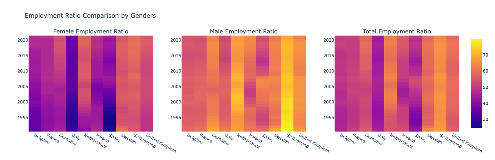

### Middle East

In Qatar, the male employment ratio showed a minor increase from 94.94% in 1990 to 96.6% in 2021. However, the percentage of women employed increased significantly from 45.32% to 59.6% over the years.

Both Iran and Iraq experienced slight improvements in female employment, with percentages rising from about 7.5% to 12.196% for Iran and 7.83% for Iraq.

Israel saw a noteworthy increase in the proportion of female workers, rising from 39.1% to 56.84%. Meanwhile, the male employment ratio remained relatively stable, changing from 63.89% to 63.67%.

Saudi Arabia witnessed an improvement in the employment ratio, particularly around 2018. The percentage increased from 13.45% in 1990 to 17.379% in 2018 and further to 21.779% in 2021.

Kuwait showed a moderate increase in female employment by approximately 5%, while male employment increased by around 7%.

In the United Arab Emirates, the male employment ratio was significantly higher than that of females in both 1990 (87.37% vs. 28.72%) and 2021 (89.8% vs. 49.2%). Although there were improvements, the gender gap in employment remains significant.

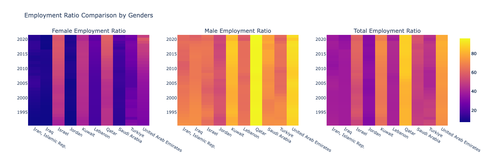

### Asia

The employment charts for men in Asian countries show consistently high proportions, ranging from 67% to 80%, with Russia having the lowest rate. However, all countries experienced a decrease in male employment from 1990 to 2021.

In the case of women, Pakistan and India had notably low employment ratios, with percentages around 30% and 34.5% respectively, possibly influenced by cultural factors such as patriarchy. Vietnam and Thailand witnessed a decline in the proportion of female workers, possibly linked to economic challenges.

Indonesia, Japan, the Philippines, and Russia had intermediate employment ratios for both men and women, with slight increases for the former and slight decreases for the latter over time.

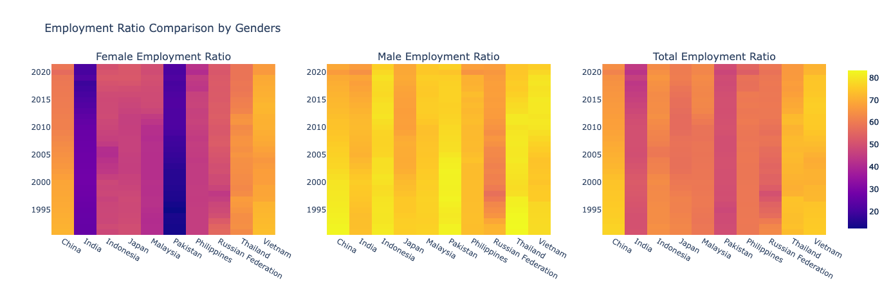

### Africa

Ethiopia and Tanzania displayed high male employment ratios, above 80%. The trend for female employment was different, with Tanzania experiencing a decrease from 80% to 75% and Ethiopia witnessing an increase from 64.6% to 70.9%.

Algeria, Egypt, and Morocco had very low female employment ratios, consistently below 15%, while male employment ratios ranged from 60% to 65%.

Ghana saw a decrease of approximately 5% in male employment and around 12% in female employment from 1990 to 2021.

In South Africa, the female employment ratio remained relatively stable, with only a 3% decrease over time. However, the male employment ratio experienced a more significant decline, decreasing from 62.41% to 45.31%.

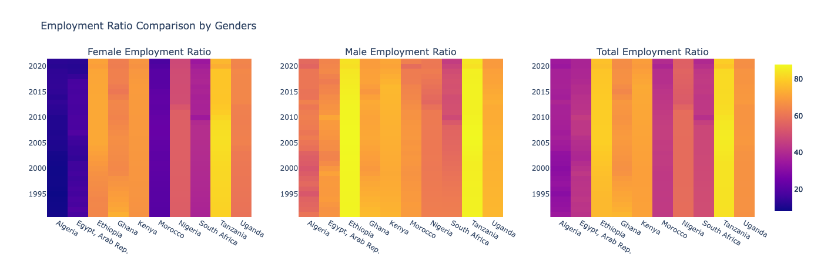

### South America

The employment ratios in South American countries displayed a wide range, from 25% to 85%. The majority of countries had female employment ratios between 40% and 50%.

Guyana's employment ratio remained relatively stable, with a minor increase from 31.78% in 1990 to 32.95% in 2021. Suriname witnessed a significant increase from 25.99% to 39.02%.

Peru displayed positive changes in both male and female employment ratios, with a notable increase for females from approximately 41% to 61.28% in 2021.

Except for Peru in the male part and Suriname before 2008, other countries experienced a decrease in male employment ratios over the years.

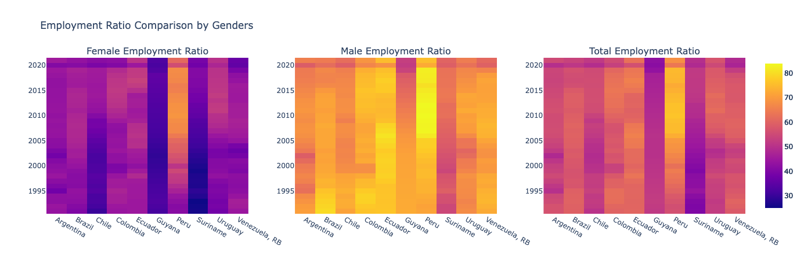

### North and Middle America

Similar to South America, North American countries had employment ratios ranging from 30% to 82%.

Canada's male employment ratio remained stable, while other countries experienced a decrease from 1990 to 2021.

For female employment ratios, except for Jamaica, all other countries experienced an increase over time.

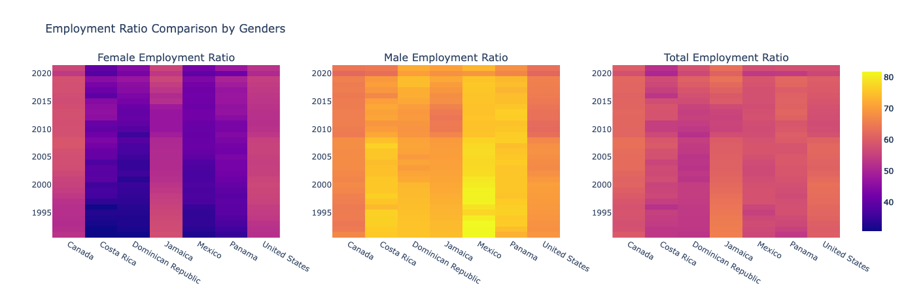

```
@app.callback(
    Output('employment-ratio-chart-heatmap', 'figure'),
    [Input('country-dropdown', 'value')]
)
def update_employment_ratio_heatmap(selected_countries):
    if len(selected_countries) > 10:
        return go.Figure()
    else:
        filtered_df = df_original[df_original['Country'].isin(
            selected_countries)]
        filtered_df = filtered_df[filtered_df['Year'] > 1990]

        employment_features = [
            'Employment to population ratio, 15+, female (%) (modeled ILO estimate)',
            'Employment to population ratio, 15+, male (%) (modeled ILO estimate)',
            'Employment to population ratio, 15+, total (%) (modeled ILO estimate)'
        ]

        global_min = filtered_df[employment_features].min().min()
        global_max = filtered_df[employment_features].max().max()

        custom_titles = ['Female Employment Ratio',
                         'Male Employment Ratio', 'Total Employment Ratio']

        n = len(employment_features)
        n_cols = min(5, n)
        n_rows = ceil(n / n_cols)

        fig = make_subplots(rows=n_rows, cols=n_cols,
                            subplot_titles=custom_titles, vertical_spacing=0.1)

        for idx, (feature, title) in enumerate(zip(employment_features, custom_titles)):
            heatmap_df = filtered_df.pivot(
                index='Year', columns='Country', values=feature)

            row = ceil((idx+1) / n_cols)
            col = (idx+1) if (idx+1) <= n_cols else (idx +
                                                     1) % n_cols if (idx+1) % n_cols != 0 else n_cols

            fig.add_trace(
                go.Heatmap(
                    z=heatmap_df.values,
                    x=heatmap_df.columns.values,
                    y=heatmap_df.index.values,
                    zmin=global_min,
                    zmax=global_max,
                    hoverongaps=False,
                    name=title,
                ),
                row=row, col=col
            )

        fig.update_layout(title_text='Employment Ratio Comparison by Genders')
        return fig
```

## Employment Equality and Life Equality Score

In this section, we examine two categories of features related to employment and life equality. The "employment_features" include indicators such as equal job opportunities, paid parental leave, retirement age parity, and discrimination prohibition in employment based on gender. The "life_features" encompass aspects such as equal inheritance rights, equal access to credit, and freedom of movement.

To assess employment equality, we calculate a score for each country by summing the values of all 18 features for each year and dividing it by the total number of features. A score of 1 indicates that all features have a "yes" value, signifying a higher level of employment equality.

Similarly, to evaluate life equality, we compute a score by summing the values of all 16 life-related features for each country and year, followed by dividing the sum by the total number of features. A score of 1 indicates that all life-related features have a "yes" value, implying a higher level of life equality.

Using these scores, we generate two heatmap charts, one for employment equality and the other for life equality, to visualize how countries' performances evolve over time. The heatmaps will help identify trends and disparities in employment and life equality across different regions and years.

### Europe

Employment Equality: Belgium, France, Germany, Italy, Spain, and Sweden have witnessed significant improvements in employment equality over time. After specific years, each of these countries achieved a score of 1, indicating the highest level of employment equality.

Life Equality: The progress in life equality in Europe has been even faster. Belgium, Germany, and Spain achieved full life equality after 2007, followed by France in 2006, the Netherlands in 2015, Poland in 2011, Sweden in 2013, and the United Kingdom in 1997.


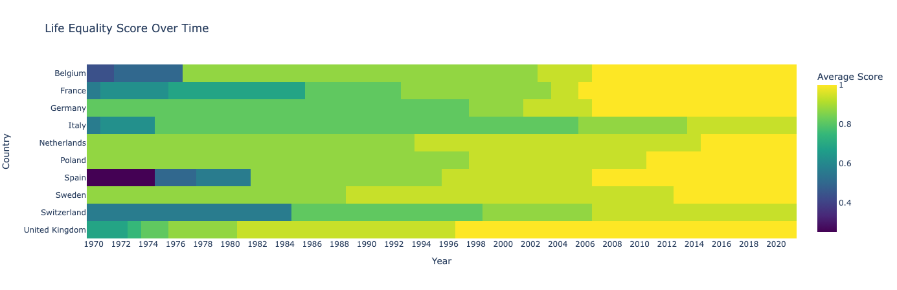

### Middle East

The situation in the Middle East regarding gender equality is not as promising. No country in the region has achieved a full score of 1 in either employment or life equality.

Iran and Iraq have experienced particularly poor progress in life equality. Iran's score of 0.3125 has remained unchanged from 1970 until 2021, while Iraq's score improved marginally from 0.3125 to 0.375 in 2016.

Saudi Arabia and the United Arab Emirates (UAE) had a situation similar to Iran before 2018, but both countries significantly improved their rights after that year, reaching a score of 0.8125 in 2021.

Israel and Turkey have relatively better scores, both achieving a grade of 0.875 after 2000 and 2006, respectively. Jordan and Qatar scored 0.5 and 0.437, respectively, in 2021.

In terms of employment equality, only the UAE scored 0.833 after 2020, while Saudi Arabia achieved a score of 0.777. Other countries in the region have scores lower than 0.5.

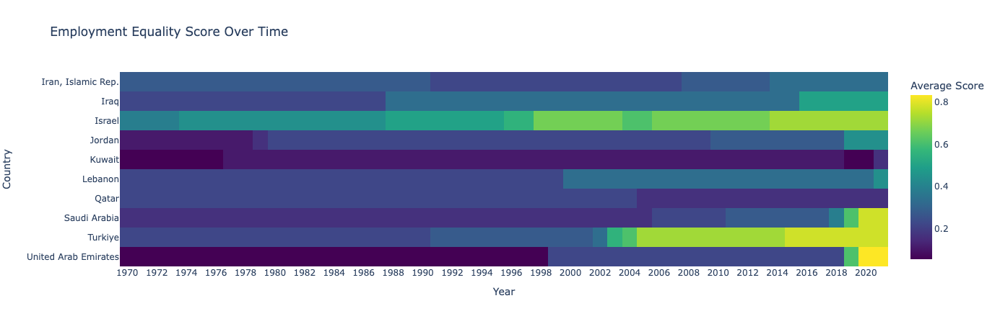
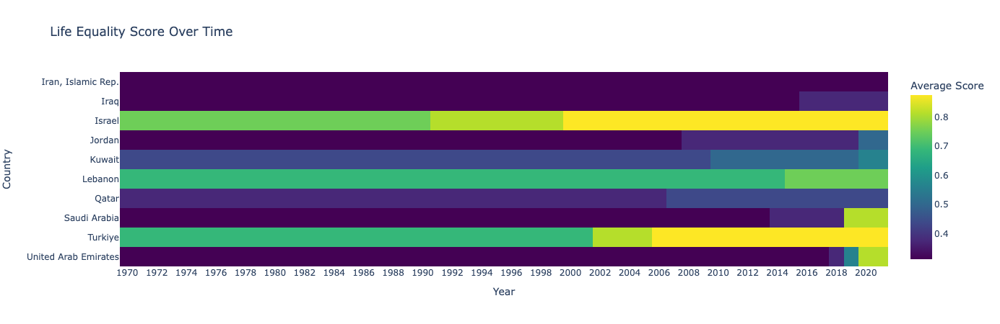

### Asia

Employment Equality: The maximum score for employment equality in Asia is 0.8. The Philippines has the highest score of 0.833 after 2012, followed by Vietnam with a score of 0.777 after 2020.

Pakistan experienced a decrease in its employment equality score from 0.27 to 0.22 between 1987 and 2008.

Life Equality: Vietnam achieved the maximum score of 1 after 2008. India and China both achieved a score of 0.937 after 2006. Russia consistently scored 0.875 from 1970 to 2021.

Malaysia had the lowest life equality score of 0.562 after 1995.

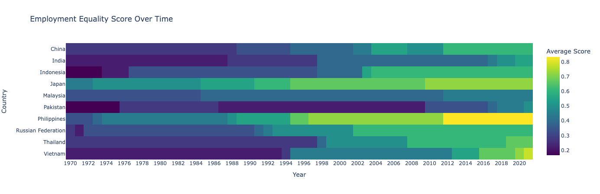


### Africa

Employment Equality: Tanzania, South Africa, Morocco, and Kenya have shown improvement in employment equality, especially after 2005. Tanzania reached the maximum score of 0.833 in 2021, while other countries scored below 0.5.

Life Equality: South Africa achieved a perfect score of 1 after 2000. Kenya, Ethiopia, and Nigeria reached a score of 0.875 after 2007 and 2020, respectively. Kenya, Morocco, and Tanzania scored 0.812 in 2021.

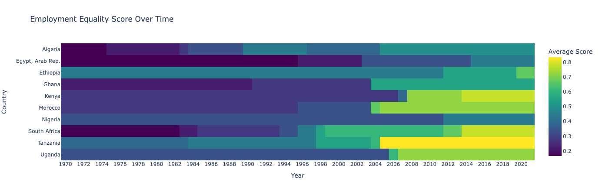
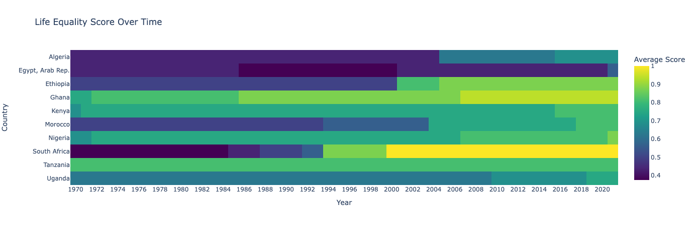

### South America

Both employment and life equality have seen good improvement among South American countries.

In employment equality, Peru achieved the highest score of 0.944, while Chile, Ecuador, Guyana, and Uruguay finished 2021 with a score of 0.888.

In life equality, the maximum score is 0.93, achieved by Argentina, Brazil, Colombia, Ecuador, Peru, and Venezuela after 2016.

Chile had the lowest score in life equality among these ten countries, with a score of 0.75.

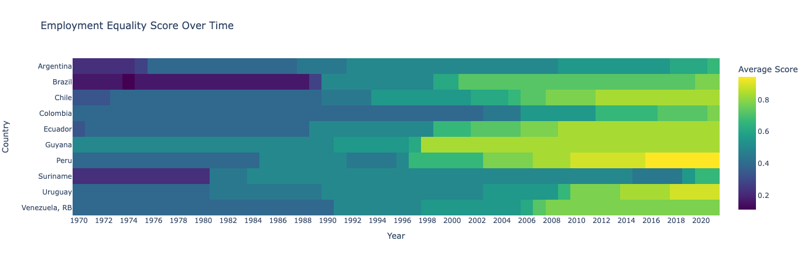
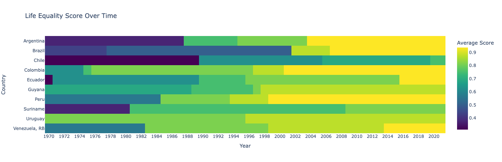

### North and Middle America

Employment Equality: Only Canada scored 1 in employment equality after 2019. Jamaica had the lowest score of 0.44 in 2021. The United States improved its score from 0.5 to 0.66 in 1981, maintaining the same score until 2018, and then increasing to 0.833.

Costa Rica, the Dominican Republic, and Mexico all achieved a score of 0.77 in 2021.

Life Equality: Canada achieved a score of 1 after 1991, followed by Mexico after 2014, and the United States after 1994.

Costa Rica, the Dominican Republic, and Jamaica scored 0.937 in 2021, and Panama had the lowest score of 0.875 after 2002.

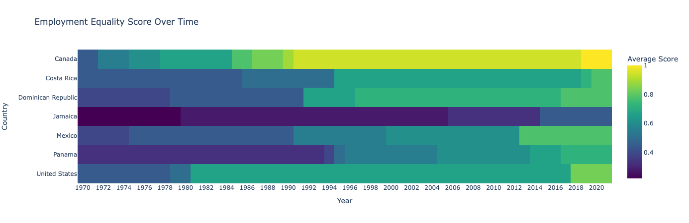
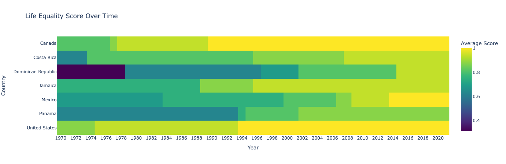

```
employment_features = [
    'A woman can get a job in the same way as a man (1=yes; 0=no)',
    'A woman can work at night in the same way as a man (1=yes; 0=no)',
    'A woman can work in a job deemed dangerous in the same way as a man (1=yes; 0=no)',
    'A woman can work in an industrial job in the same way as a man (1=yes; 0=no)',
    'Dismissal of pregnant workers is prohibited (1=yes; 0=no)',
    'Law mandates equal remuneration for females and males for work of equal value (1=yes; 0=no)',
    'There is paid parental leave (1=yes; 0=no)',
    'Paid leave is available to fathers (1=yes; 0=no)',
    'Paid leave of at least 14 weeks available to mothers (1=yes; 0=no)',
    'The age at which men and women can retire with full pension benefits is the same (1=yes; 0=no)',
    'The age at which men and women can retire with partial pension benefits is the same (1=yes; 0=no)',
    'The government administers 100% of maternity leave benefits (1=yes; 0=no)',
    'The law prohibits discrimination in employment based on gender (1=yes; 0=no)',
    'The law provides for the valuation of nonmonetary contributions (1=yes; 0=no)',
    'The mandatory retirement age for men and women is the same (1=yes; 0=no)',
    'There are periods of absence due to childcare accounted for in pension benefits (1=yes; 0=no)',
    'Criminal penalties or civil remedies exist for sexual harassment in employment (1=yes; 0=no)',
    'There is legislation on sexual harassment in employment (1=yes; 0=no)'
]

life_features = [
    'A woman can open a bank account in the same way as a man (1=yes; 0=no)',
    'Male and female surviving spouses have equal rights to inherit assets (1=yes; 0=no)',
    'Men and women have equal ownership rights to immovable property (1=yes; 0=no)',
    'The law grants spouses equal administrative authority over assets during marriage (1=yes; 0=no)',
    'The law prohibits discrimination in access to credit based on gender (1=yes; 0=no)',
    'A woman can apply for a passport in the same way as a man (1=yes; 0=no)',
    'A woman can be head of household in the same way as a man (1=yes; 0=no)',
    'A woman can choose where to live in the same way as a man (1=yes; 0=no)',
    'A woman can obtain a judgment of divorce in the same way as a man (1=yes; 0=no)',
    'A woman can travel outside her home in the same way as a man (1=yes; 0=no)',
    'A woman can travel outside the country in the same way as a man (1=yes; 0=no)',
    'A woman has the same rights to remarry as a man (1=yes; 0=no)',
    'The law is free of legal provisions that require a married woman to obey her husband (1=yes; 0=no)',
    'There is legislation specifically addressing domestic violence (1=yes; 0=no)',
    'A woman can register a business in the same way as a man (1=yes; 0=no)',
    'A woman can sign a contract in the same way as a man (1=yes; 0=no)'
]


def calculate_average_score(df, selected_countries, features):
    df_selected = df[df['Country'].isin(selected_countries)]

    for feature in features:
        df_selected[feature] = df_selected[feature].interpolate()

    df_selected['Average Score'] = df_selected[features].mean(axis=1)
    df_selected = df_selected[['Country', 'Year', 'Average Score']]

    return df_selected


@app.callback(
    Output('employment-equality-chart', 'figure'),
    [Input('country-dropdown', 'value')]
)
def update_employment_equality_chart(selected_countries):
    df_score = calculate_average_score(
        df, selected_countries, employment_features)

    heatmap_data = df_score.pivot(
        index='Country', columns='Year', values='Average Score')

    fig = px.imshow(heatmap_data,
                    labels=dict(x='Year', y='Country', color='Average Score'),
                    title='Employment Equality Score Over Time',
                    color_continuous_scale='Viridis')

    fig.update_xaxes(nticks=len(heatmap_data.columns.unique()))

    return fig


@app.callback(
    Output('life-equality-chart', 'figure'),
    [Input('country-dropdown', 'value')]
)
def update_life_equality_chart(selected_countries):
    df_score = calculate_average_score(df, selected_countries, life_features)

    heatmap_data = df_score.pivot(
        index='Country', columns='Year', values='Average Score')

    fig = px.imshow(heatmap_data,
                    labels=dict(x='Year', y='Country', color='Average Score'),
                    title='Life Equality Score Over Time',
                    color_continuous_scale='Viridis')

    fig.update_xaxes(nticks=len(heatmap_data.columns.unique()))

    return fig
```

## Women Business and the Law Index Score

In the preceding section, we assessed the score of each country by evaluating its laws. Now, in the following section, our objective is to compare the 'Women Business and the Law Index Score', a unique feature obtained directly from the data source. We will be specifically focusing on the results from 2020 and comparing neighboring countries. The aim is to observe trends in a particular area and its neighboring regions. To present this data visually, we have mapped the information. It's worth noting that while similarities are expected among neighboring countries, there may be some variations, represented by different colors on the map. The intention is to avoid a completely uniform color range and allow for distinguishing nuances in the data.

In addition, another goal of visualizing the data on a geographic map is to explore whether the size of these countries we are analyzing has any influence on their respective scores. We are curious to see if there is a correlation between a country's size and its score on the index. For instance, we want to investigate whether smaller countries tend to have higher scores, or if larger countries tend to have lower scores, though we must note that this relationship may not necessarily exist. It's important to mention that we currently lack any verified resources to definitively prove or disprove such a correlation.

The index measures how laws and regulations affect women’s economic opportunity. Overall scores are calculated by taking the average score of each index (Mobility, Workplace, Pay, Marriage, Parenthood, Entrepreneurship, Assets and Pension), with 100 representing the highest possible score.

Women, Business and the Law tracks progress toward legal equality between men and women in 190 economies. Data are collected with standardized questionnaires to ensure comparability across economies. Questionnaires are administered to over 2,000 respondents with expertise in family, labor, and criminal law, including lawyers, judges, academics, and members of civil society organizations working on gender issues. Respondents provide responses to the questionnaires and references to relevant laws and regulations.

### Europe

In Europe, there is a relatively consistent score range across most countries. Switzerland stands out with the lowest score (indicated by red color) in the 4th place, while Poland has the second-lowest score (indicated by orange color) in the 3rd place. The other countries show similar scores in this region.

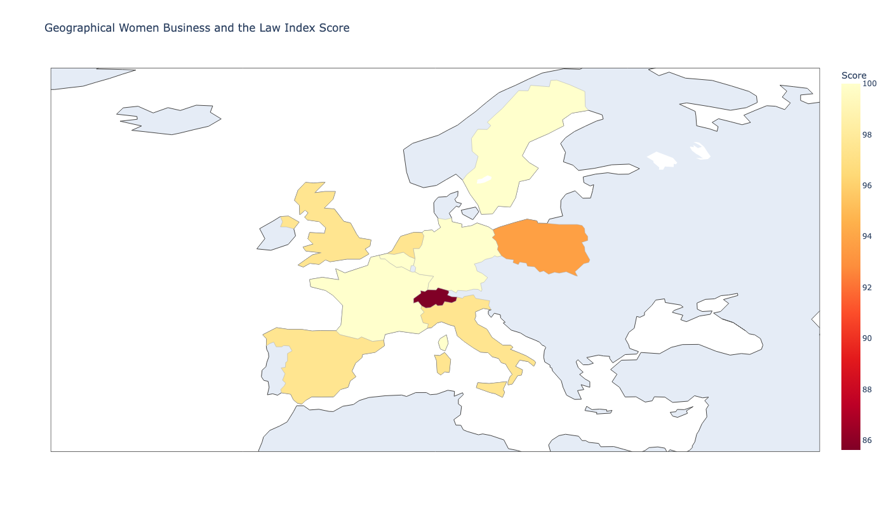

### Middle East

In the Middle East, it is evident that the scores do not reach the maximum of 100. Countries with better life and employment equality, such as Turkey, Israel, Saudi Arabia, and the United Arab Emirates, also have higher scores in this indicator. On the other hand, Kuwait, Qatar, and Iran, which have lower life and employment equality, also exhibit the lowest scores in this area.

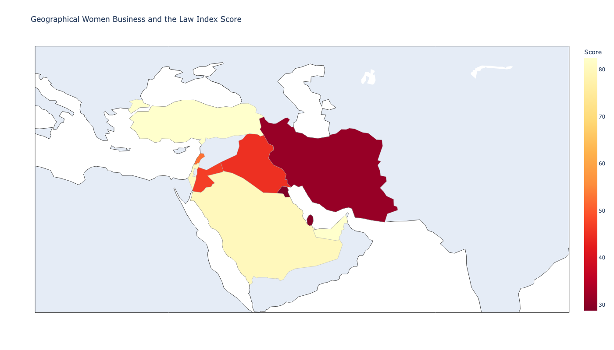

### Asia

In Asia, Russia, India, and China, three of the largest countries in the region, show similar scores. As observed in previous indicators, Pakistan and Malaysia have the lowest scores in this part as well.

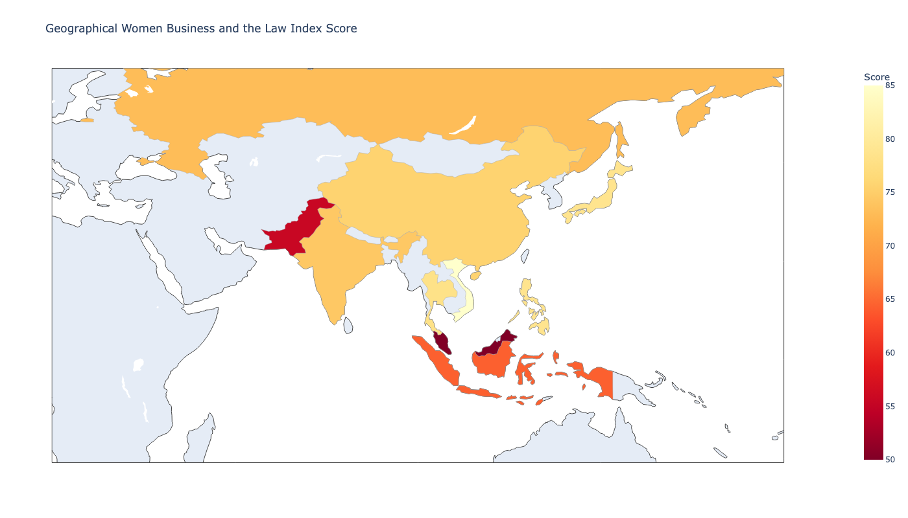

### Africa

The scores in Africa also exhibit a relatively uniform range among seven out of ten countries. Egypt stands out with the lowest score of 45, while the maximum score is 88.12. Most countries in this region fall within the intermediate range of scores.

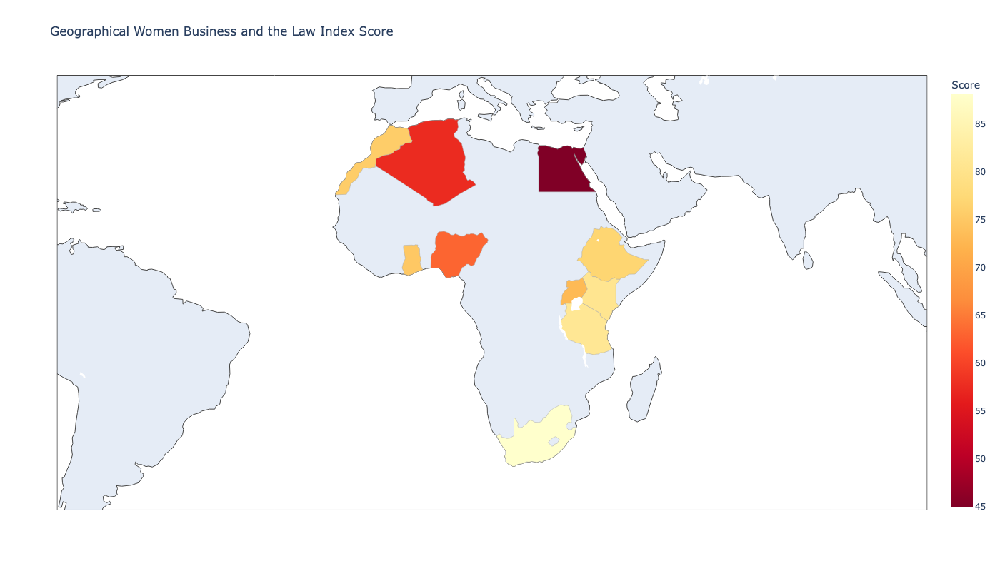

### South America

In South America, there is a consistent trend as seen before. Peru leads with the highest score (95), and it is worth noting that the minimum score in this area is 70, indicating a relatively smaller difference between the highest and lowest scores compared to other regions. South America shows a lower range of scores in comparison to other regions, with few fluctuations (except for Europe with higher values in all indicators).

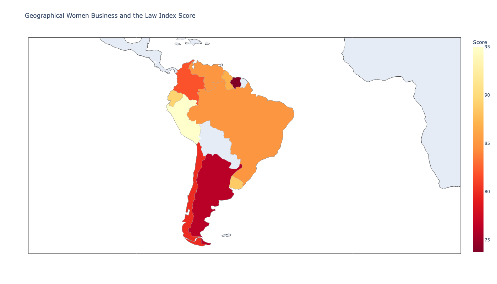

### North and Middle America

North America demonstrates relatively close scores on the map. Canada has the highest score, followed by the United States with a score of 91.25 in the 2nd place. Middle American countries also have similar scores, with a lower range than North America.

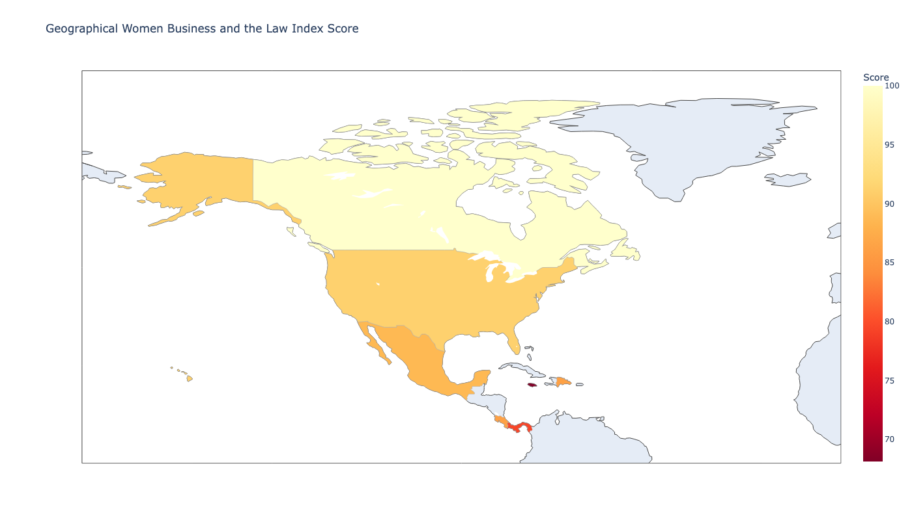

```
world = gpd.read_file(gpd.datasets.get_path('naturalearth_lowres'))


def geolocate(country):
    try:
        geometry = world[world['name'] == country]['geometry'].values[0]
        bounds = geometry.bounds
        return bounds
    except (IndexError, AttributeError):
        print(f'Cannot find {country}')
        return None


@app.callback(
    Output('world-map', 'figure'),
    [Input('country-dropdown', 'value'),
     Input('year-radio', 'value')])
def update_figure(selected_countries, selected_year):
    if not selected_countries or not selected_year:
        return go.Figure()
    else:
        filtered_df = df[df.Year == selected_year]
        filtered_df = filtered_df[filtered_df['Country'].isin(
            selected_countries)]

        latitudes_min = []
        longitudes_min = []
        latitudes_max = []
        longitudes_max = []
        for country in selected_countries:
            loc = geolocate(country)
            if loc is not None:
                minx, miny, maxx, maxy = loc
                latitudes_min.append(miny)
                longitudes_min.append(minx)
                latitudes_max.append(maxy)
                longitudes_max.append(maxx)

        if not latitudes_min or not longitudes_min or not latitudes_max or not longitudes_max:
            print('Could not find geolocation for the selected countries.')
            center_lat = 0
            center_lon = 0
        else:
            center_lat = (max(latitudes_max) + min(latitudes_min)) / 2
            center_lon = (max(longitudes_max) + min(longitudes_min)) / 2

        fig = go.Figure(data=go.Choropleth(
            locations=filtered_df['Country Code'],
            z=filtered_df['Women Business and the Law Index Score (scale 1-100)'],
            text=filtered_df['Country'],
            colorscale='YlOrRd',
            autocolorscale=False,
            reversescale=True,
            marker_line_color='darkgray',
            marker_line_width=0.5,
            colorbar_tickprefix='',
            colorbar_title='Score',
        ))

        fig.update_layout(
            geo=dict(
                showframe=True,
                showcoastlines=True,
                projection_type='equirectangular',
                center=dict(lat=center_lat, lon=center_lon),
                projection_scale=2
            ),
            width=1400,
            height=800,
            autosize=True
        )
        fig.update_layout(
            title_text='Geographical Women Business and the Law Index Score')

        return fig


if __name__ == '__main__':
    app.run_server(debug=True)
```

# Conclusion

In this project, we set out to explore and compare the situation of women's rights and gender equality across various regions and countries worldwide. Through data visualization and analysis using the World Bank's Gender Statistics database, we aimed to gain insights into how different regions and countries have progressed in terms of gender equality over the years.

The analysis of population trends across regions revealed interesting patterns. In general, the population of both males and females has been increasing over time. However, there are some variations in the growth rates and fluctuations among different countries. Notably, female populations often displayed more substantial variations compared to their male counterparts, indicating potential shifts in demographics and societal factors affecting women's lives.

Additionally, we compared the employment ratios and labor force proportions among countries. It was observed that some countries have consistently higher labor force proportions and employment ratios, suggesting a more active and engaged workforce. On the other hand, certain countries faced challenges in achieving higher labor force participation, possibly due to cultural, economic, or social factors.

We also examined the employment ratios categorized by gender and the total population. It was evident that across regions, the proportion of female workers in the labor force was consistently lower than that of male workers. This discrepancy highlights the ongoing gender disparities in the workforce.

Furthermore, we evaluated employment equality and life equality scores for each country. The results showed that while some countries have made significant progress in both areas, others still face challenges in achieving gender equality. Certain countries in Europe demonstrated higher scores in employment and life equality, while some countries in the Middle East and Asia struggled with lower scores.

Finally, we analyzed the Women Business and the Law Index Score, which measures how laws and regulations affect women's economic opportunity. This index provides insights into the legal framework supporting gender equality in various economies. While scores varied among countries, it is apparent that significant room for improvement remains in many regions to ensure equal opportunities for women in the business and legal realms.

In conclusion, this project has shed light on the status of women's rights and gender equality across different parts of the world. The data visualizations and analyses have provided valuable insights into the progress made in gender equality and the challenges that persist. By understanding these trends and disparities, we can work towards promoting gender equality and empowering women in all aspects of life. However, it is crucial to recognize that achieving true gender equality requires continued efforts, policy changes, and societal transformation on a global scale. Only by addressing these issues collectively can we build a world where women's rights are upheld, and gender equality is a reality for everyone, regardless of their geographic location.

# design decision details

The objective of this project is to shed light on the status of women's rights across the world, focusing on key indicators such as life equality, employment equality, population distribution, and labor force participation. Initially, the goal was to encapsulate all the information into a single chart, but it became apparent that this approach lacked the depth required to comprehensively represent women's rights. As a result, a multi-faceted approach was adopted, utilizing various visualization techniques to compare different aspects and provide a more nuanced understanding of the subject matter.

**1. Message the Figure is Supposed to Convey:**
The figure aims to convey a holistic view of women's rights by presenting a comparative analysis of crucial indicators across ten selected countries. Rather than a singular focus, the visualizations aim to highlight the interconnectedness of various aspects and their impact on women's empowerment. By presenting a comprehensive picture, the figure seeks to reveal trends, disparities, and progress made in different regions over time.

**2. Target Audience:**
The target audience for this visualization is individuals interested in gender equality, human rights activists, policymakers, researchers, and anyone seeking a comprehensive overview of women's rights globally.

**3. Reason for Choosing Specific Visualizations:**

a. **Line Charts for Populations and Labor Force/Employment Ratio:**

- Advantages: Line charts effectively display trends over time, allowing for easy comparison between different variables. They enable the visualization of population changes and employment ratios over the years for each country.
- Disadvantages: When multiple line charts overlap, readability can be an issue, especially with ten countries. To address this, separate charts for total population, male population, and female population are used.

b. **Subplot Charts for Employment Ratio and Labor Force Ratio:**

- Advantages: Subplot charts allow side-by-side comparison of two related indicators, such as employment ratio and labor force ratio, in a single visualization. The use of distinct colors (red and blue) aids in differentiating between the two indicators.
- Disadvantages: If too many subplots are used, the visual clutter can reduce interpretability. However, in this case, the number of subplots is manageable (one for each country).

c. **Heatmap for Gender Employment Ratio, Life Equality, and Employment Equality:**

- Advantages: Heatmaps are effective for comparing one feature (gender employment ratio) across multiple countries over several years. They highlight patterns and changes through the use of colors.
- Reason for 'Viridis' Colors: 'Viridis' colors offer smoother transitions, making it easier to interpret the heatmap, especially with long lines representing several years of data.

d. **Geographic Maps for Business and Law Score:**

- Advantages: Geographic maps provide a spatial perspective, allowing viewers to see both the scores and the location/size of the countries simultaneously. This helps in understanding regional variations in business and law scores.
- Disadvantages: Geographical distortion might occur when representing countries near the poles.

**4. Design Decisions:**

a. Rearrangement of Line Charts: To avoid overlapping, the line charts for population distribution are separated into three charts: total population, male population, and female population. The 2-row and 5-column arrangement ensures better visibility and comparison.

b. Rotating X and Y Values in Heatmaps: By using years on the X-axis and countries on the Y-axis, the changes in life equality, and employment equality are more easily readable.

**Conclusion:**
By combining various visualization types and making thoughtful design decisions, the figure effectively presents a comprehensive picture of women's rights across different countries. The use of line charts, subplot charts, heatmaps, and geographic maps allows for easy comparison, trend analysis, and spatial understanding, making the figure informative and insightful for the target audience.