# Women's Rights and Gender Equality Around the World - Project Introduction

## Overview

Welcome to the project "Women's Rights and Gender Equality Around the World." This project is part of my individual assignment for the data visualization course in the Master of Data Science program. The objective of this project is to explore and compare the situation of women's rights and gender equality across various regions and countries worldwide.

## Project Purpose

The primary purpose of this project is to analyze and visualize key indicators related to women's rights and gender equality using data from the World Bank's Gender Statistics database. By examining a range of factors, we aim to gain insights into how different regions and countries have progressed in terms of gender equality over the years.

## Data Source

To conduct this analysis, I utilized the data available from the World Bank's Gender Statistics database, which can be accessed at 'https://databank.worldbank.org/source/gender-statistics'. This dataset provides valuable information on various socio-economic indicators related to gender, such as population totals, employment ratios, labor force participation, employment quality, life quality, and the Women Business and the Law Index Score.

## Methodology and Tools

For the analysis and visualization, I utilized Python along with Plotly and Dash libraries. These powerful tools enable us to create interactive and insightful visualizations to better understand the patterns and trends in gender-related data. The geopy library allowed us to work with geographic data, and geopandas was used to handle geographical mapping.

## Project Scope

The project focuses on six major regions of the world, namely:

1. Europe
2. Middle East
3. Asia
4. Africa
5. South America
6. North and Middle America

Within each of these regions, we selected ten countries to analyze in detail. The chosen countries are as follows:

- Europe: United Kingdom, France, Germany, Italy, Spain, Belgium, Netherlands, Switzerland, Sweden, Poland
- Middle East: Saudi Arabia, Iran, Islamic Rep., Israel, Turkey, United Arab Emirates, Iraq, Lebanon, Qatar, Jordan, Kuwait
- Asia: China, Japan, India, Vietnam, Russian Federation, Thailand, Indonesia, Pakistan, Philippines, Malaysia
- Africa: Egypt, Arab Rep., South Africa, Nigeria, Kenya, Morocco, Ethiopia, Tanzania, Algeria, Ghana, Uganda
- South America: Brazil, Argentina, Venezuela, RB, Uruguay, Colombia, Chile, Peru, Guyana, Suriname, Ecuador
- North and Middle America: United States, Canada, Mexico, Panama, Costa Rica, Jamaica, Dominican Republic


## Let's Begin!

With the groundwork set, we are now ready to delve into the fascinating world of gender equality and women's rights. Let's explore the data and discover insights that shed light on the progress and challenges faced by women in different parts of the world. The subsequent sections will present a detailed analysis of each region and country, accompanied by visualizations to enhance the overall understanding of the subject matter.

### Data Import and Preparation 
```
from geopy.geocoders import Nominatim
import pandas as pd
import plotly.express as px
from dash import Dash
from dash import dcc, html
from dash.dependencies import Input, Output, State
import plotly.graph_objs as go
from sklearn.preprocessing import StandardScaler
from plotly.subplots import make_subplots
from math import ceil
import geopandas as gpd


geolocator = Nominatim(user_agent='geoapiExercises')


def prepare_data(file_path):
    df = pd.read_csv(file_path)

    df = df[['Series Name', 'Country Name', 'Country Code'] +
            [col for col in df if col.startswith('19') or col.startswith('20')]]

    df = df.melt(id_vars=['Series Name', 'Country Name', 'Country Code'],
                 var_name='Year', value_name='Value')

    df['Year'] = df['Year'].str.extract('(\d+)').astype(int)

    df = df.pivot_table(index=['Country Name', 'Year', 'Country Code'],
                        columns='Series Name', values='Value').reset_index()

    df.columns.name = ''
    df.rename(columns={'Country Name': 'Country'}, inplace=True)

    all_countries = df['Country'].unique().tolist()
    return df, all_countries


group_features = ['Population, total',
                  'Population, female',
                  'Population, male',]

regions = {
    'Europe': ['United Kingdom', 'France', 'Germany', 'Italy', 'Spain', 'Belgium', 'Netherlands', 'Switzerland', 'Sweden', 'Poland'],
    'Middle East': ['Saudi Arabia', 'Iran, Islamic Rep.', 'Israel', 'Turkiye', 'United Arab Emirates', 'Iraq', 'Lebanon', 'Qatar', 'Jordan', 'Kuwait'],
    'Asia': ['China', 'Japan', 'India', 'Vietnam', 'Russian Federation', 'Thailand', 'Indonesia', 'Pakistan', 'Philippines', 'Malaysia'],
    'Africa': ['Egypt, Arab Rep.', 'South Africa', 'Nigeria', 'Kenya', 'Morocco', 'Ethiopia', 'Tanzania', 'Algeria', 'Ghana', 'Uganda'],
    'South America': ['Brazil', 'Argentina', 'Venezuela, RB', 'Uruguay', 'Colombia', 'Chile', 'Peru', 'Guyana', 'Suriname', 'Ecuador'],
    'North and middle America': ['United States', 'Canada', 'Mexico', 'Panama', 'Costa Rica', 'Jamaica', 'Dominican Republic'],

}

df, all_countries = prepare_data('../../data/cleaned_data.csv')
df_original = df.copy()
```

### Import App layout and Set Order of Charts
```
app = Dash(__name__)


app.layout = html.Div([
    dcc.Dropdown(
        id='country-dropdown',
        options=[{'label': country, 'value': country}
                 for country in all_countries],
        multi=True,
        value=[]
    ),
    dcc.RadioItems(
        id='region-radio',
        options=[{'label': region, 'value': region}
                 for region in regions.keys()],
        value=None
    ),
    dcc.Graph(id='line-chart-total'),
    dcc.Graph(id='line-chart-female'),
    dcc.Graph(id='line-chart-male'),
    dcc.Graph(id='employment-ratio-chart'),
    dcc.Graph(id='employment-ratio-chart-heatmap'),
    dcc.Graph(id='employment-equality-chart'),
    dcc.Graph(id='life-equality-chart'),
    html.Label('Select Year:'),
    dcc.RadioItems(
        id='year-radio',
        options=[{'label': str(i), 'value': i}
                 for i in [1970, 1980, 1990, 2000, 2010, 2020]],
        value=2020,
        labelStyle={'display': 'inline-block'}
    ),
    html.Div(
        dcc.Graph(id='world-map'),
        style={
            'display': 'flex',
            'justify-content': 'center',
            'width': '100%'
        }
    ),

])
```

## Dynamic Country Dropdown Selection Based on Region
This part of the report defines a callback function using the Dash framework to update the values displayed in the country dropdown menu based on the selected region. When a user selects a region using the radio buttons, the country dropdown will dynamically update to show only the countries belonging to the selected region, providing a streamlined and relevant user experience for data exploration.

```
@app.callback(
    Output('country-dropdown', 'value'),
    [Input('region-radio', 'value')],
    [State('country-dropdown', 'options')]
)
def update_dropdown_values(selected_region, available_options):
    if selected_region is None:
        return []
    else:
        region_countries = regions[selected_region]
        return [country['value'] for country in available_options if country['value'] in region_countries]
```

## Population Trend Over the Time

The initial charts illustrate the trends in population over the years, but it is important to note that the actual values for population were standardized to facilitate a clearer assessment of the patterns of change. Three key features were employed in this analysis:
- Population, total
- Population, female
- Population, male

### Europe

The overall trends for all European regions indicate a nearly equal population change between men and women over time. The United Kingdom and Spain show similar patterns with a consistent increase over the years. Poland, Italy, the Netherlands, and Germany also exhibit a predominantly increasing trend, with only minor fluctuations. Belgium experienced a notable increase until 1999, followed by a sharp decline in 2000, leading to a subsequent gradual decrease. In Sweden, there were sporadic changes before 1986, with intermittent increases and decreases. However, from 1986 until 2004, there was a significant and continuous increase, interrupted by a sudden decrease in 2010 but recovering again from 2011 onwards. Switzerland experienced growth until 1981, followed by a relatively stable period until 2002, after which there was a continuous increase until 2014, and a subsequent decline.

The charts for females and males exhibit similar shapes, with Switzerland showing particularly pronounced changes. Female populations display more substantial variations compared to their male counterparts, leading to the inference that changes in population are potentially more linked to female demographics.

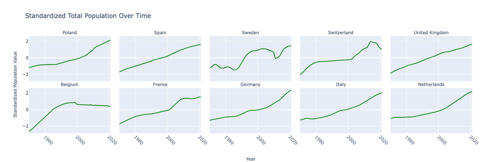
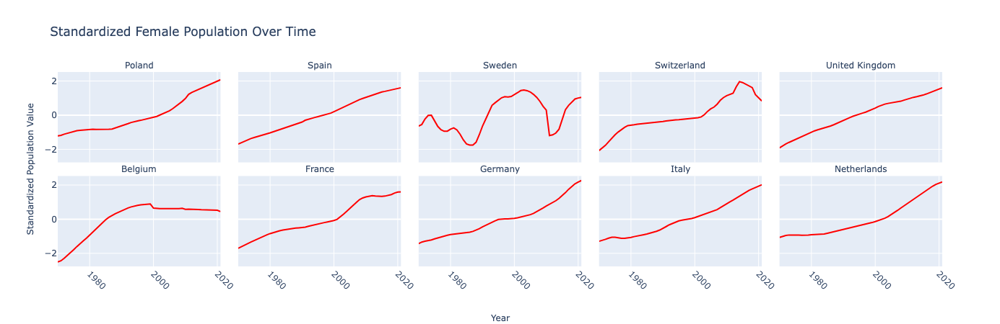
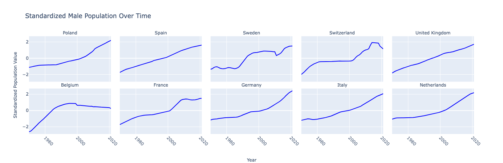


### Middle East
Among the Middle Eastern countries analyzed, Lebanon, Qatar, Saudi Arabia, Turkey, Israel, and Jordan demonstrate a gradual and steady increase in population over time. Iran, however, exhibits two distinct peaks, one around 1977 and another in 2012, with intermittent declines in between. Iraq experienced a significant change in its slope around 2005, characterized by a steep increase. The United Arab Emirates witnessed a sharp decrease in 1989, followed by consistent growth until 2019. Kuwait's population exhibited a steady increase until 2005, after which it followed a pronounced upward trajectory until 2010, eventually leveling off to a gradual incline.

The changes observed in female and male populations closely mirror those of the total population, with the exception of Iraq, where the male line displays fluctuations compared to the relatively stable female line.

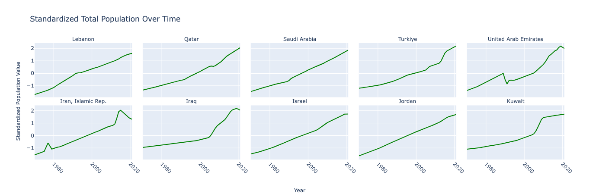
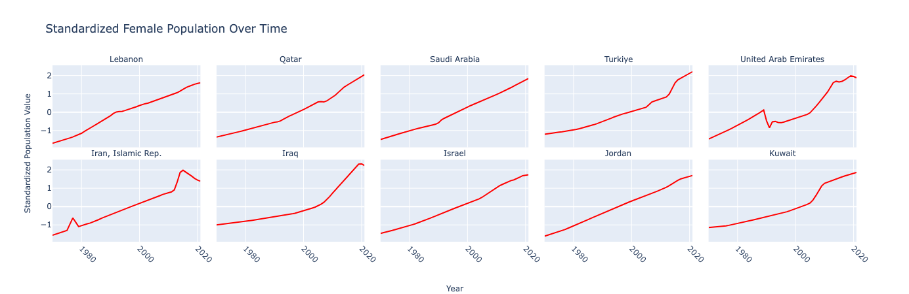
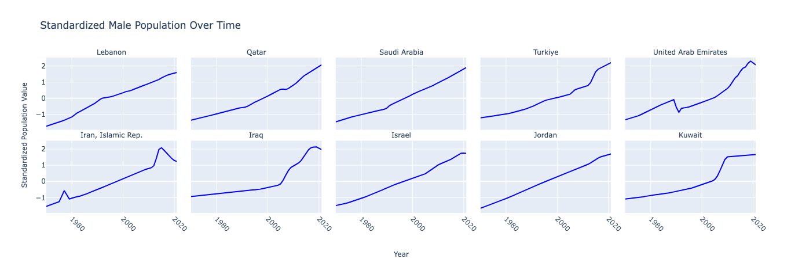

### Asia
Across the Asian countries studied, Pakistan, the Philippines, Russia, Vietnam, Malaysia, Japan, India, and China all exhibit a similar pattern of population growth, characterized by a consistent upward trend. Thailand, however, displays a convex trend, reaching its peak around 2003 and declining thereafter. Indonesia's population increased steeply until 1990, followed by a relatively stable period until 1995, and then a gradual decrease until 2008, with minor changes thereafter.

The patterns for male and female populations closely resemble that of the total population across these Asian countries.

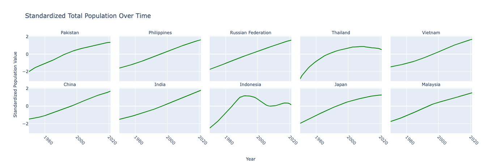
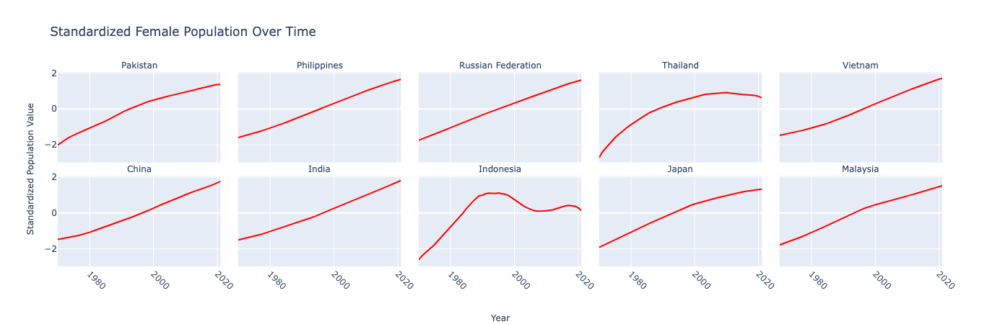
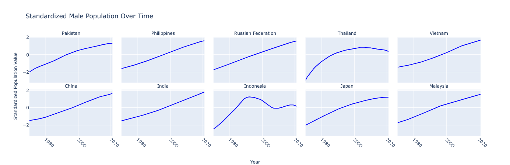

### Africa
In all African countries analyzed, there is a uniform trend of population growth, with a smooth, steady increase over time. Ethiopia shows only marginal changes in its population line.

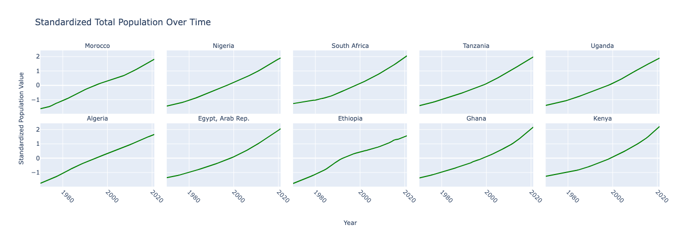

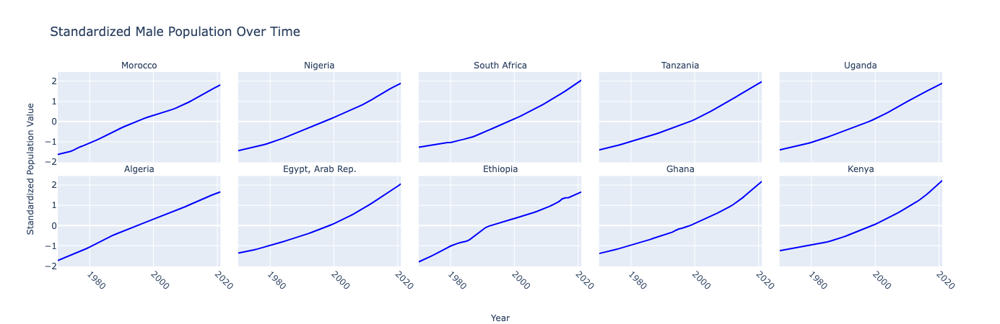

### South America
In most South American countries, including Guyana, Suriname, Uruguay, Venezuela, Ecuador, Brazil, and Colombia, the population follows a similar pattern with a consistent upward trend. Ecuador, however, displays a decline in population after 2017.

Chile's population shows a slight decrease until 1980, followed by a pattern akin to other countries in the region. Argentina exhibits significant fluctuations, with periods of rapid increase, followed by declines and subsequent fluctuations.

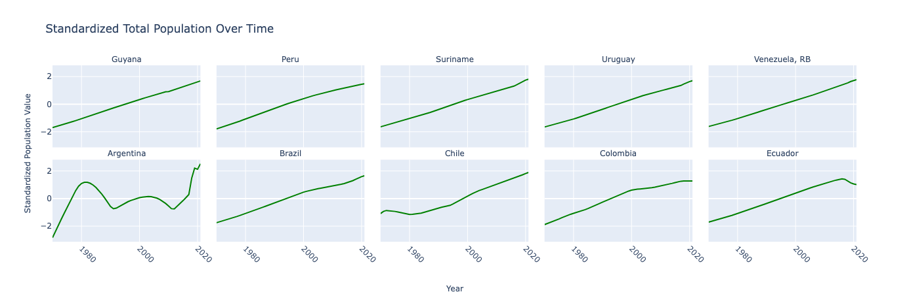
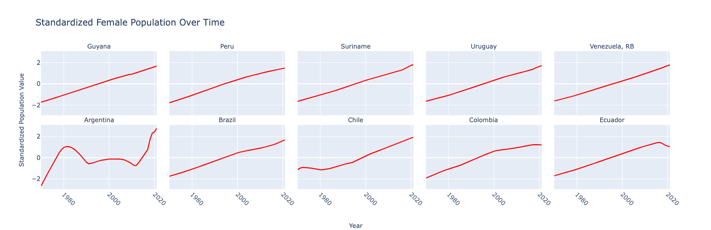
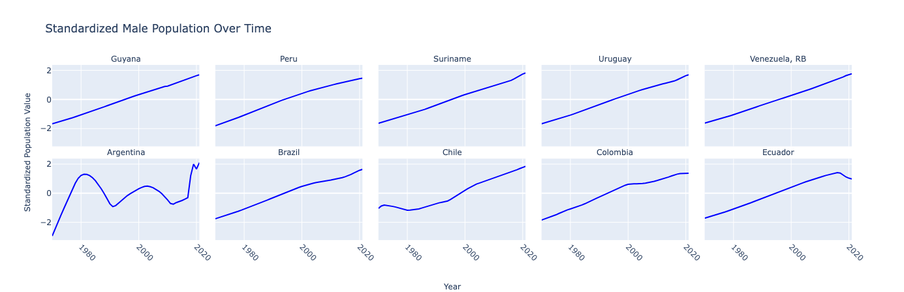

### North and Middle America
Throughout North and Middle America, the trend of population growth remains consistent, with all countries showing a steady increase over time.

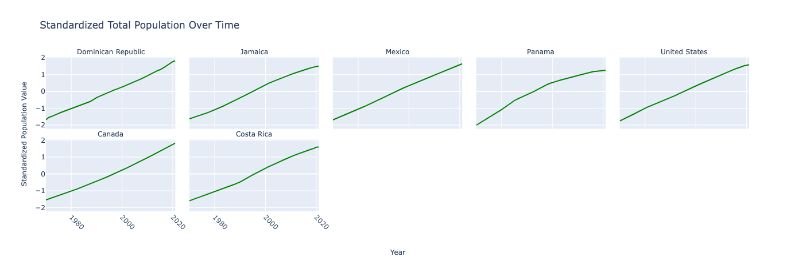
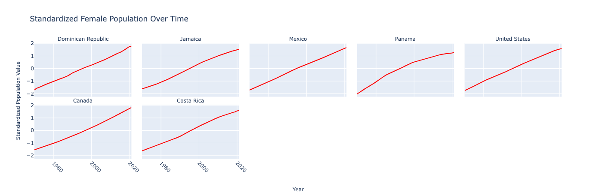
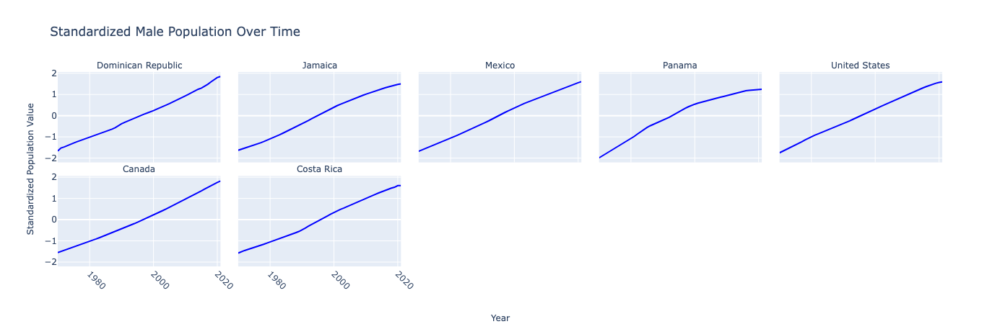

## Comparison between Employment Ratio and Labor Force Proportion
The comparison between the labor force, employment ratio, and population aims to examine whether these indicators exhibit similar trends over time. It is anticipated that the labor force and employment ratio would follow a similar pattern as the population, but other factors such as economic conditions and natural resources could influence these values. 

The labor force proportion was calculated manually.


### Europe
Among the selected European countries, Switzerland stands out with a consistently higher labor force proportion, ranging from 55% to 58%, and an employment ratio between 53% and 55%. This suggests that Switzerland potentially has a relatively young population, contributing actively to the labor force. Conversely, Belgium, France, and Italy have labor force proportions less than 45%, which could indicate a higher proportion of either young individuals (under 14 years old) or an aging population with more retirees. Notably, Netherlands and Germany show an increase in labor force proportion after 1998 and 2006, respectively. Overall, the differences between labor force and employment ratios in Europe range from 5% to 1.5%.

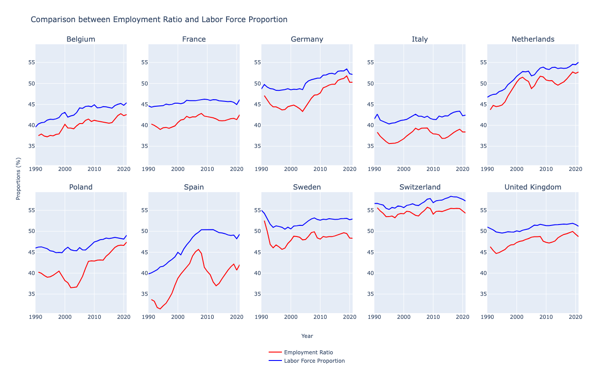


### Middle East
In the Middle East, Qatar and Kuwait have the highest labor force proportions, starting from 60% and 40%, respectively, in 1990 and reaching approximately 74.5% and 59% in 2020. The differences between their labor force and employment ratios remain minimal, around 1% to 2%, indicating a consistently higher percentage of their populations actively participating in the labor force. On the other hand, countries like Iran, Iraq, Jordan, Lebanon, and Saudi Arabia have lower labor force proportions, ranging from less than 30% to 32%, with differences of about 4% between their labor force and employment ratios. This suggests a proportionately smaller working-age population or higher proportions of older and very young individuals.

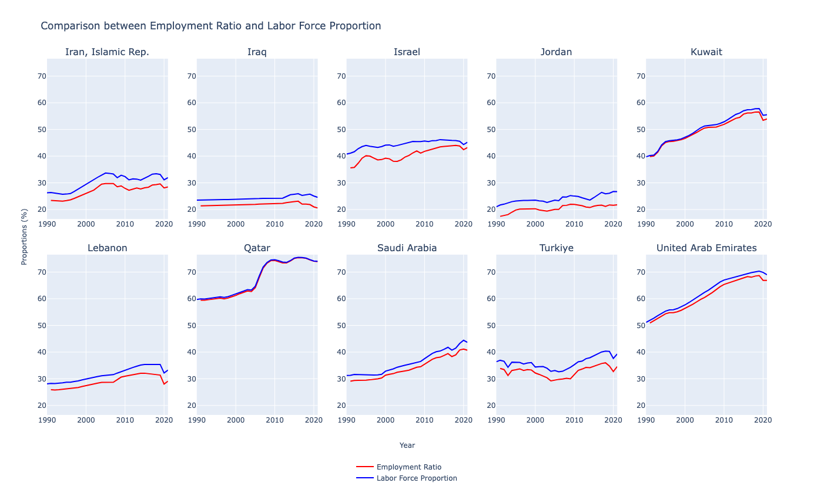


### Asia
In Asia, Pakistan witnessed changes in labor force proportion and employment ratio after 2010, with the employment ratio reaching 31.14% in 2021 and a difference of about 3% compared to the labor force proportion. China, India, Indonesia, Japan, Malaysia, and Vietnam all showed increasing trends in both labor force and employment ratios. For instance, Japan had a labor force proportion of 56.3% in 1990, increasing to 54.78% in 2021, with a maximum employment ratio of 52.7% in 2021. Notably, Russia had fluctuations in its labor force proportion, going below 50% between 1993 and 2000, and showing differences of 6% to 3% compared to the employment ratio during those years.

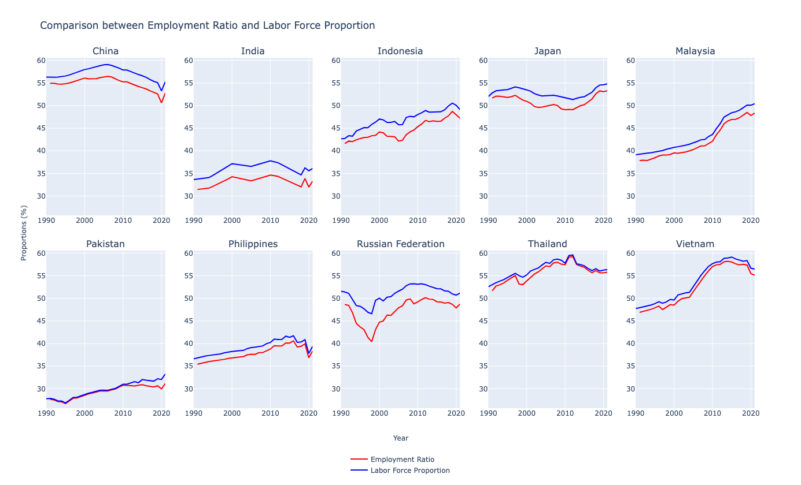


### Africa
In Africa, South Africa showed the most significant difference between labor force and employment ratios, with a maximum difference of about 10% and labor force proportions around 42% in 2008. Algeria witnessed decreasing differences over time, starting from about 9% before 2000 and reducing to about 3.5% in 2021. Egypt's labor force proportion ranged from 30.05% in 2010, with relatively consistent differences during the years analyzed. Morocco and Nigeria maintained interval changes in their labor force and employment ratios, with both countries having a maximum employment ratio of about 32%.

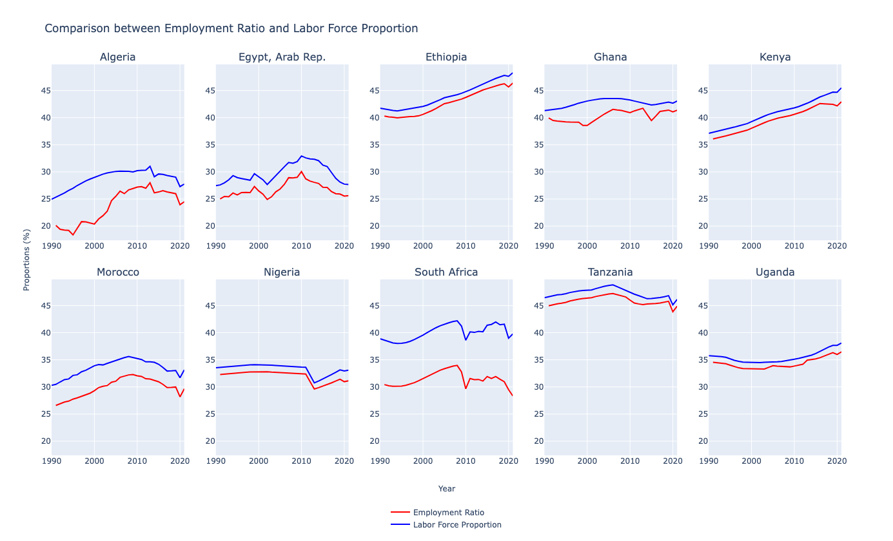


### South America
In South America, Peru experienced the most significant changes in both labor force and employment ratios, with the employment ratio increasing from 34.2% to 54.3%, respectively, and the labor force proportion ranging from 38.8% to 45.12%. Argentina and Colombia witnessed an increase in the differences between their labor force and employment ratios from 1995 to 2005, indicating potential shifts in labor market dynamics.

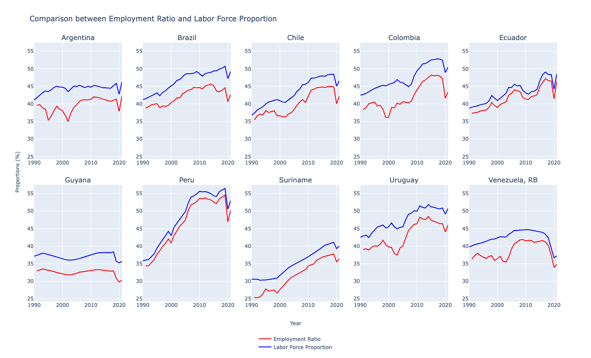


### North and Middle America
North American countries, the United States, and Canada both had labor force proportions above 50%. However, the employment ratio for the United States was consistently less than 50%, while Canada's employment ratio ranged from 45% to 52.5% over the years. Costa Rica reached a labor force proportion of 50% in 2020, while Jamaica reached more than 50% in 2015, with maximum employment ratios of 50.39% in 2021, indicating the active participation of a significant portion of their populations in the labor force.

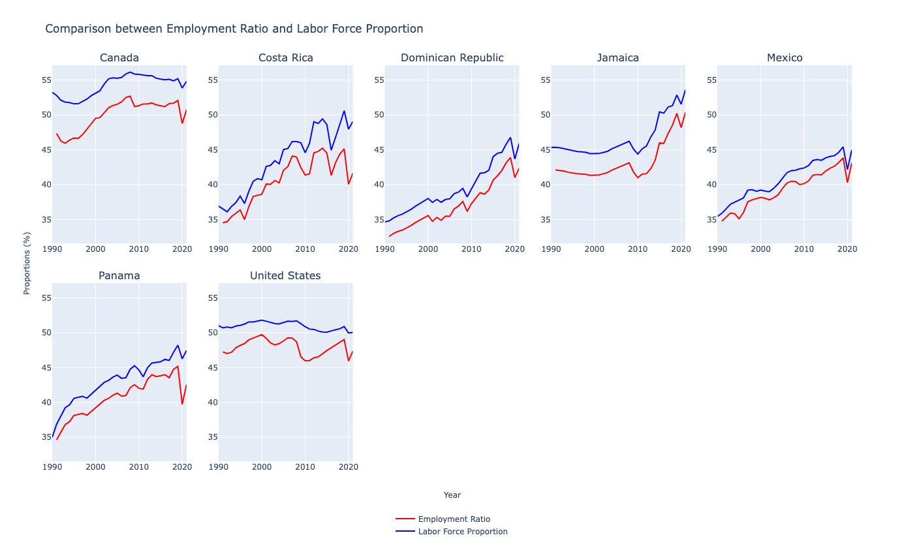

